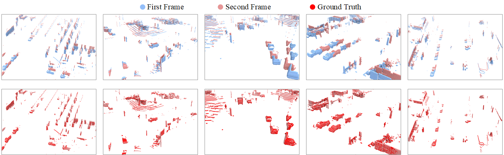

# Deformation and Correspondence Aware Unsupervised Synthetic-to-Real Scene Flow Estimation for Point Clouds
This is the code related to "Deformation and Correspondence Aware Unsupervised Synthetic-to-Real Scene Flow Estimation for Point Clouds" (CVPR 2022).
<p align='center'>
  
</p>


## GTA-V Scene Flow (GTA-SF) Dataset
GTA-SF Dataset [Download](https://1drv.ms/u/s!Ap1U6ygZ8oBwhCJgydLCFJpfZyFD?e=6G4ngc)

Some examples of our generated data (Ground Truth refers to the result of adding scene flow to the first frame):
<p align='center'>
  
</p>

## Environment
* Python >= 3.5.2
* Pytorch 1.7.1
* CUDA 11.1

## Data Preparation
### GTA-SF
Download the [GTA-SF dataset](https://1drv.ms/u/s!Ap1U6ygZ8oBwhCJgydLCFJpfZyFD?e=6G4ngc) and organize all files as follows:
```
|—— dataset
|   |── GTA-SF
|   |   |── 00
|   |   |—— 01
|   |   |...
|   |   |—— 05
```

### Waymo
Download the official [Waymo Open Dataset](https://waymo.com/open/download/), 

### Lyft
Download the official [Lyft Perception Dataset](https://level-5.global/data/perception/),

### KITTI Scene Flow


Trained models [Link](https://1drv.ms/u/s!Ap1U6ygZ8oBwhBSpZjaMHM4CbrJM?e=Jw5khg)


## Citation
