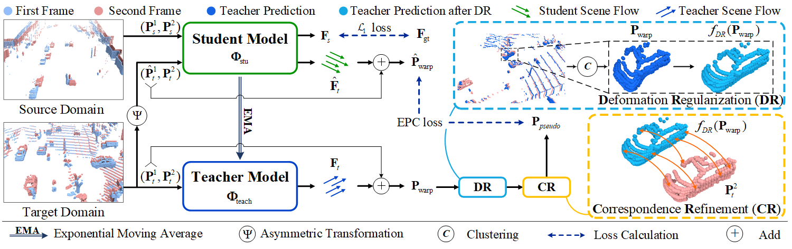

# Deformation and Correspondence Aware Unsupervised Synthetic-to-Real Scene Flow Estimation for Point Clouds
This is the code related to "Deformation and Correspondence Aware Unsupervised Synthetic-to-Real Scene Flow Estimation for Point Clouds" (CVPR 2022).

  

