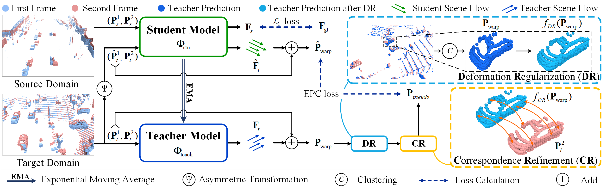

# Deformation and Correspondence Aware Unsupervised Synthetic-to-Real Scene Flow Estimation for Point Clouds
This is the code related to "Deformation and Correspondence Aware Unsupervised Synthetic-to-Real Scene Flow Estimation for Point Clouds" (CVPR 2022).
<p align='center'>
  
</p>

## 1. Paper
[Deformation and Correspondence Aware Unsupervised Synthetic-to-Real Scene Flow Estimation for Point Clouds]()


## Citation
```
@inproceedings{peng2021sparse,
  title={Sparse-to-dense Feature Matching: Intra and Inter domain Cross-modal Learning in Domain Adaptation for 3D Semantic Segmentation},
  author={Peng, Duo and Lei, Yinjie and Li, Wen and Zhang, Pingping and Guo, Yulan},
  booktitle={Proceedings of the International Conference on Computer Vision (ICCV)},
  year={2021},
  publisher={IEEE}
}
```
